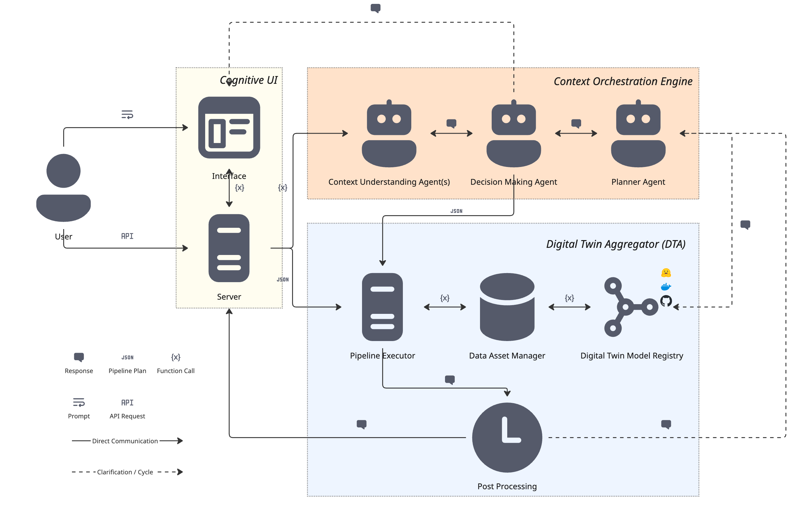

# Summary

DT4LC (Digital Twin for Land Cover) is an extensible Python framework for land cover change detection that combines geospatial analysis methods, machine learning models and large language model (LLM) orchestration into a cognitive digital twin. The framework includes built-in algorithms and models --- including spectral indices (NDVI, EVI, NDWI, NDSI), multi-index change detection, land cover classification and the NASA/IBM Prithvi foundation model --- and is designed to be extended with additional methods, third-party models and custom analysis pipelines through a declarative component registry. Users interact with the system through natural language via the cognitive interface, while developers can access the execution engine directly through the REST API.

The core of the software is a four-stage cognitive orchestration engine that translates user intent into executable analysis pipelines: (1) an intent classifier distinguishes analysis requests from conversational queries, (2) a context agent extracts structured goals from natural language, (3) a hybrid planner selects between template-based and LLM-powered pipeline generation and (4) a plan validator checks type compatibility and resource constraints before execution. The declarative registry allows researchers to integrate new algorithms or external models by implementing a Python function and adding a YAML configuration entry, making the framework adaptable to diverse research workflows.

# Statement of Need

Monitoring land cover change from satellite imagery is critical for disaster management, agricultural planning and environmental governance. Current workflows require researchers to manually select algorithms, configure processing chains and interpret raw outputs --- tasks that demand both domain knowledge and programming expertise. DT4LC addresses this by providing an end-to-end framework where analysis pipelines are automatically generated from natural language descriptions of research goals. The target audience includes remote sensing researchers, environmental scientists and disaster response teams who need to perform land cover analysis without building custom processing pipelines. The conceptual foundations of the dual-timescale digital twin approach are described in [@kussul2026dt4lc_springer], the full framework architecture and disaster-region case studies in [@kussul2025ai], foundation model integration in [@kussul2025idaacs] and the cognitive user interface design in [@chernyatevich2026igarss].

# State of the Field

Existing geospatial analysis tools fall into three categories. Cloud platforms such as Google Earth Engine [@gorelick2017google] and Microsoft Planetary Computer provide data access and scalable computation but lock users into specific ecosystems and require API programming. Desktop processing libraries such as RSGISLib [@bunting2014rsgislib], Orfeo ToolBox [@grizonnet2017orfeo] and GDAL offer algorithm implementations but require manual pipeline construction and provide no intelligent orchestration. AI-focused frameworks (TorchGeo [@stewart2022torchgeo], Prithvi [@jakubik2023foundation]) deliver model inference but require ML engineering expertise for integration.

No existing tool provides an extensible, local-first framework that combines built-in geospatial analysis methods with the ability to integrate third-party models on demand, all orchestrated through natural language interaction. DT4LC fills this gap by providing a declarative registry architecture where both built-in and user-contributed components are treated uniformly, while an LLM-powered cognitive layer abstracts pipeline complexity from end users.

# Software Design

DT4LC follows a modular architecture organized into two core layers --- the Context Orchestration Engine and the Digital Twin Instance --- fronted by a web-based interface (\autoref{fig:arch}).

**Context Orchestration Engine (COE).** The cognitive layer processes user requests through four stages: (1) intent classification determines whether the request requires data processing or conversational response; (2) context extraction parses natural language into structured goals, desired outputs and domain keywords; (3) hybrid planning selects between fast template-based matching for common requests and LLM reasoning for novel scenarios; (4) plan validation checks dependency satisfaction and runner configuration before execution.

**Digital Twin Instance (DTI).** The execution layer dispatches validated plans to three types of runners: algorithm runners for classical methods (e.g., spectral indices, change detection, classification), model runners for ML models (e.g., Prithvi, Delineate-Anything) and agent runners for LLM-based result interpretation. All components --- whether built-in or user-contributed --- are registered uniformly in a YAML registry that declares their inputs, outputs and keywords, allowing type-safe pipeline composition and on-demand extensibility.

**Multi-provider LLM routing.** The framework supports multiple LLM backends (currently Gemini, Groq and local Ollama; additional providers are configurable) with automatic fallback strategies (priority-based, cost-aware or availability-based), so the system can operate both with cloud API access and fully offline using local models.

**Interactive map and data management.** The web-based interface includes an interactive map for spatial exploration of analysis results, a data management module for uploading and organizing satellite imagery and a job tracking system for monitoring pipeline execution.

The component registry enables extensibility without modifying framework code: a new algorithm or third-party model requires only a Python `run()` function and a `registry.yaml` entry declaring its inputs, outputs and keywords to become available through natural language interaction.

For example, a user request such as "detect changes in Kahovka" is classified as a pipeline intent, the context agent extracts a change detection goal, and the planner assembles a three-step pipeline: `input/file-before` → `input/file-after` → `algorithms/change-detection`. Installation instructions, deployment via Docker and usage examples are provided in the repository README.

# Research Impact Statement

DT4LC was developed as part of the DT4LC project (Grant 2023.01/0040) under the Ukrainian-Swiss Joint Research Programme funded by the Swiss National Science Foundation. The framework has been the subject of four peer-reviewed publications spanning the full research lifecycle. The dual-timescale digital twin concept and its positioning relative to existing Earth system DTs (DestinE, NASA ESDT, BioDT) were introduced in [@kussul2026dt4lc_springer]. The complete framework architecture, including modular Digital Twin Instances for vegetation dynamics, land use classification and climate forecasting, was presented in [@kussul2025ai] with pilot validation on post-flood vegetation recovery monitoring and annual forest dynamics assessment across Ukraine and Switzerland. Foundation model integration strategies, including adaptation of Prithvi and physics-informed neural networks, were evaluated in [@kussul2025idaacs]. The LLM-driven multi-agent cognitive interface --- the distinguishing software contribution of this submission --- was presented in [@chernyatevich2026igarss], demonstrating the system's ability to support both rapid anthropogenic impact assessment and long-term environmental monitoring through conversational interaction. The software is actively used by researchers at the National Technical University of Ukraine "Igor Sikorsky Kyiv Polytechnic Institute" and the University of Geneva, with concrete applications to post-flood vegetation recovery monitoring in the Kahovka region and to annual forest dynamics assessment across Ukraine and Switzerland [@kussul2025ai]; a Sentinel-2 sample of the Kahovka case is bundled with the repository so that reviewers and new users can reproduce the change-detection workflow end-to-end.

# AI Usage Disclosure

Large language models (Gemini, Groq-hosted LLaMA, local Ollama) are integral components of the DT4LC software architecture, used at runtime for intent classification, pipeline planning and result interpretation. During development, Claude (Anthropic) was used for code refactoring and test scaffolding. All AI-assisted outputs were reviewed, edited and validated by the human authors.

# Acknowledgements

This work was supported by the project "DT4LC -- Developing Scalable Digital Twin Models for Land Cover Change Detection Using Machine Learning" (Grant 2023.01/0040), the Ukrainian-Swiss Joint Research Programme (USJRP) funded by the Swiss National Science Foundation (SNSF), the HORIZON Europe projects SWIFTT (Grant 101082732) and FUTUREFOR (Grant 101180278) and the NASA-funded projects "Assessment of the Impact of War in Ukraine on National Protected Areas" (Grant 80NSSC25K7652) and "Detecting and Mapping War-Induced Damage to Agricultural Fields in Ukraine Using Multi-Modal Remote Sensing Data" (Grant 80NSSC24K0354).

# References
